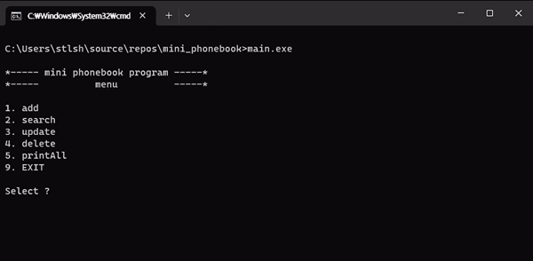

# Mini_PhoneBook 📞



## ⚙️Background
- Intened to make first simple program
- No Fancy UI, Just console base program.
- It looks good to me 😎


## How to work
- Able to Manipulating the program by entering text information based on the guide shown in console window.
- It has functions that **Read/Write/Search/Delete** PhoneBook item. 
- No Database, but text file named *```phone-number.txt```* will be created when you add first item.


## Snapshots 📷

* **Writing(Insert) new Item 📝**


* **Deleting existed Item 🗑️**


* **Searching existed Item 🔍**


* **Reading and Printing All Item 🖨️**


## Issues to be fixed
- [x] when there is no text file,
    - [x] search, it has to check whether the file is exist or not
    - [x] update, after checking the file, cursor is unable to move to next.
    - [x] delete, after checking the file, it should back to menu, however it asks which number of item would be deleted.
- [ ] when deleting with written item in the file,
    - [ ] after stopping and running the program again, when I delete specific item then some buffer text items are written in the file. but target of deleting has no problem. 
    - [ ] sometimes all items are deleted when conducting delete menu.
- [ ] Updating item,
    - [ ] ... 